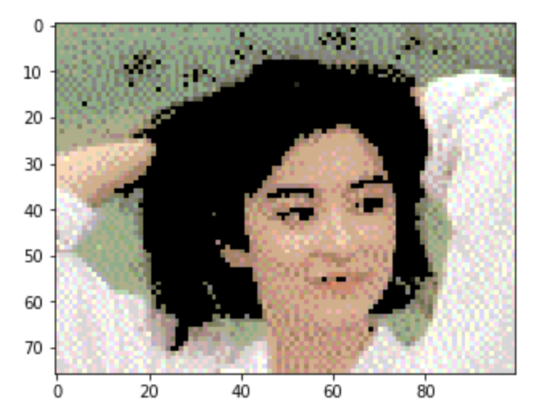

img2txt2img
=======

Convert images to text and back again.

Example
-------

```py
from img2txt import img2txt
from txt2img import txt2img

img = plt.imread('./example/jiaozhu.jpg')
txt = img2txt(img, antialias=True, dither=True, do_ansi=True, subpixel_ratio=32)
img2 = txt2img(txt)

plt.imshow(img2)
```



Installation
------------

```bash
$ virtualenv venv
$ . venv/bin/activate
(venv)$ pip install img2txt.py
```

Authors
-------

- @EdRowe (#4, #7)
- @shakib609 (#10)
- @mattaudesse (#11)
- @hit9
- @stong
- @hgarrereyn

License
-------

BSD.
